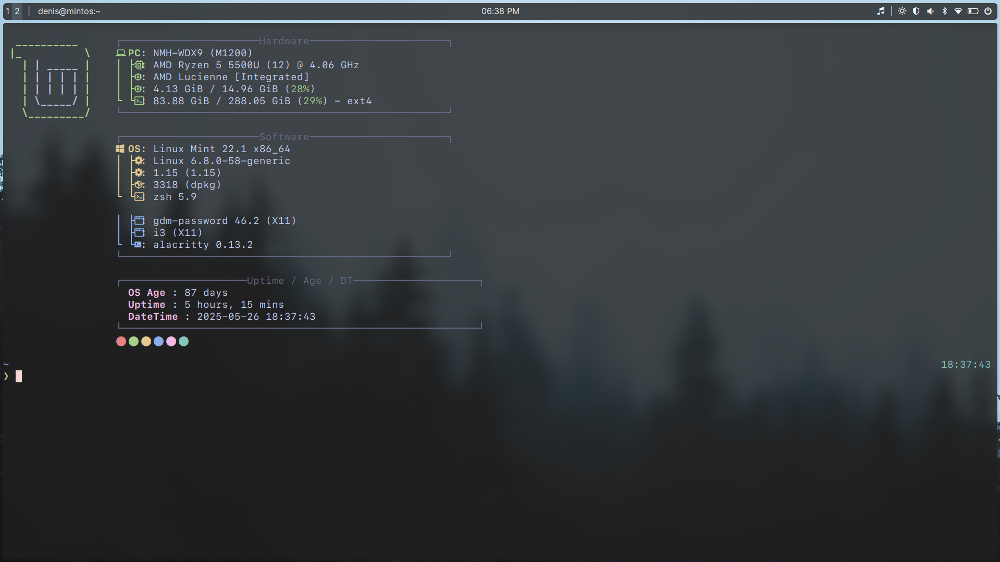
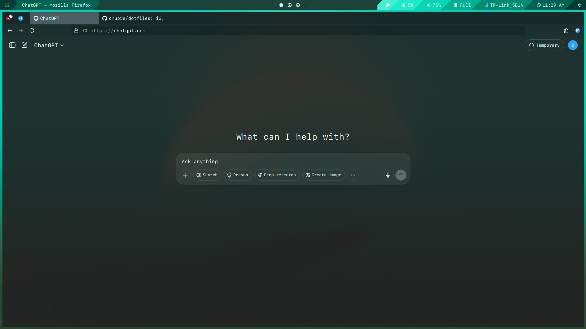
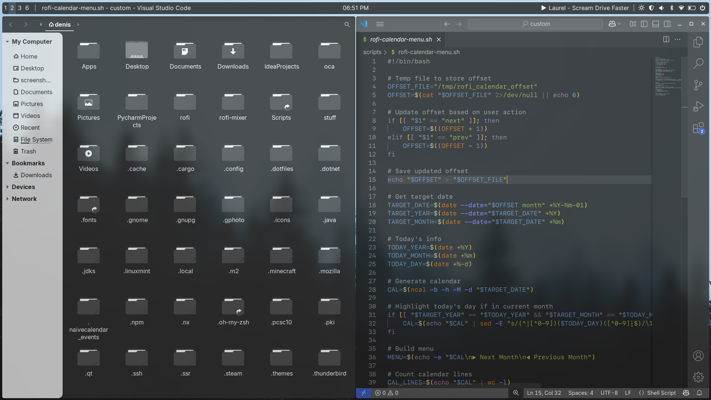
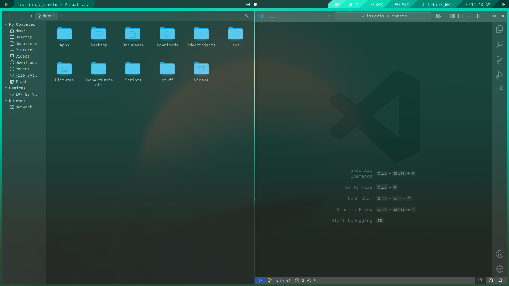
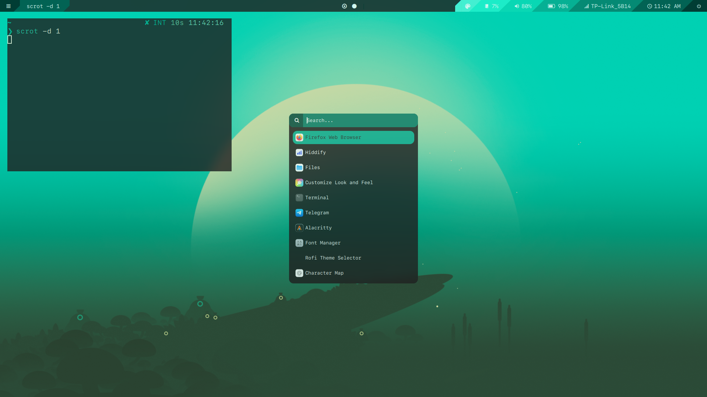
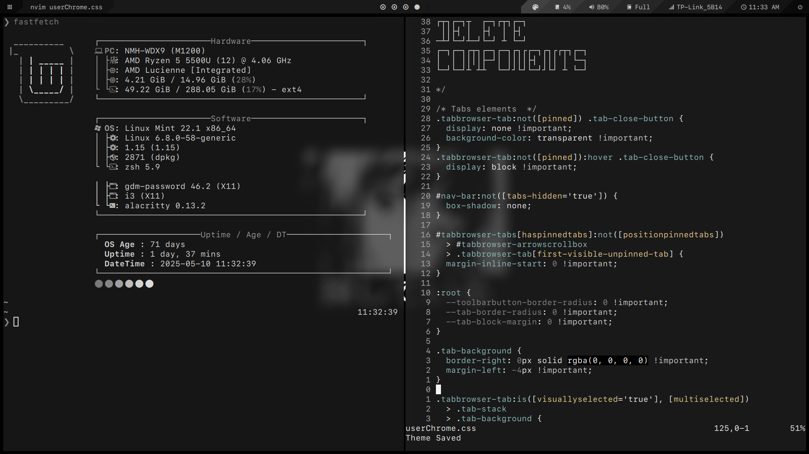
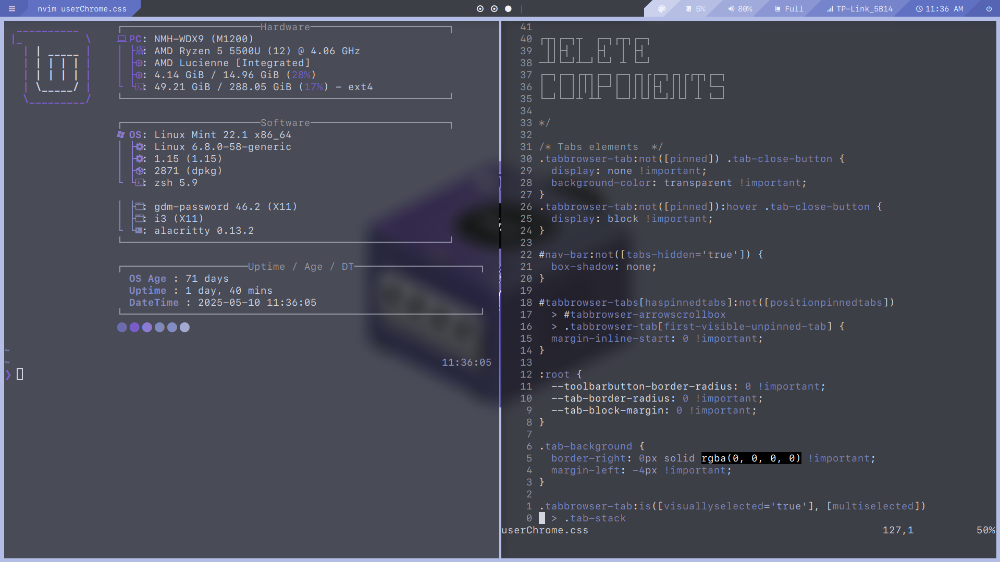

## Visual Customizations

Here are the visual components I use in my setup:

- **Wallpapers**: [dharmx/walls](https://github.com/dharmx/walls.git)
- **GTK Theme**: [WhiteSur-dark](https://github.com/vinceliuice/WhiteSur-gtk-theme)
- **Icon Theme**: [WhiteSur (alt version)](https://github.com/vinceliuice/WhiteSur-icon-theme)
- **Font**: [SFMono Nerd Font](https://github.com/epk/SF-Mono-Nerd-Font)
- **Cursor**: [XCursor-pro](https://github.com/ful1e5/XCursor-pro)
- **Notificastion daemon**: [Mate Notification Daemon](https://github.com/mate-desktop/mate-notification-daemon)

## Wallpaper & Colorscheme Automation

I use a custom script called `random_wallpaper_i3.sh` to automate theming across my system. Here's what it does:

- Picks a random wallpaper from my wallpaper directory.
- Uses [`pywal`](https://github.com/dylanaraps/pywal) and ['colorthief](https://github.com/lokesh/color-thief)to generate a color scheme based on the selected wallpaper.
- Applies the generated color scheme to:
  - **Alacritty** (terminal emulator)
  - **Polybar** (status bar)
  - **Rofi** (application launcher).

> The polybar and rofi theming part is a bit slow, but the result is nice.  
> I originally tried using the `pywal` script provided in [adi1090x/polybar-themes](https://github.com/adi1090x/polybar-themes) (this is where I got the initial polybar config), but it didn't preserve the intended shading style of the polybar theme and resulted in poor visuals. So I wrote my own simple script that respects the design better. Since font color doesn't change, sometimes it may be difficult to read with light wallpapers, probably should make the script adjust font color.

> **Note**: Many of the scripts in this repo were originally created for personal use and may include hardcoded file paths or other system-specific details. If you're planning to use them, expect to do some tweaking to get everything working on your setup.
